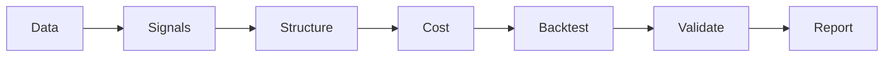

# NIFTY Short-Premium Research Lab

[](https://github.com/subbu-31/nifty-short-premium-lab/actions/workflows/ci.yml)

We tested a retail options-selling playbook — the catalogued anomalies and
strategy ideas from Euan Sinclair's *Retail Options Trading* — against 71
weeks of real NIFTY (Indian index) options data. Almost none of it
survived. This is the log of how we found that out, and the one lead
that's still open.

`4 confirmed` &middot; `9 null` &middot; `3 retracted` &middot; `1 open lead (p=0.065)`

## Before you read another number

Single underlying (NIFTY). One 16-month window (Jan 2025–May 2026). **No
crash regime in-sample.** Every "confirmed" finding below is unfalsified
against a real tail event — that's not a caveat buried in a footnote, it's
the honest scope of what 71 weeks can tell you. Read the numbers with that
in mind before you read them at all.

## What survived, what didn't

| Idea | Status | Evidence |
|---|---|---|
| Volatility risk premium | Confirmed | Implied vol overshoots realized on 75.2% of days, mean spread +1.60pt |
| Strangle beats condor (cost structure) | Confirmed | Condor loses 31–60% of gross P&L to transaction cost vs. strangle's 7–13%, under two independent cost-parameter scenarios |
| Raw-price momentum streak | Confirmed | n=569 days, correlation −0.109, permutation p=0.010, independently re-derived twice with matching results to 4 decimal places |
| **VIX-percentile regime gate** | **Open lead** | Every structure net-negative in the bottom VIX tercile; survives temporal-stability and outlier-sensitivity stress tests; family-wise corrected **p=0.065** — real, not yet proof |
| VWKS (volume-weighted strike/spot) | Null | Correlation with next-day return −0.03 to −0.05, all p>0.38 |
| Hurst exponent regime | Null | Indistinguishable from a simulated random walk once bias-corrected |
| Straddle Breakout Effect (the book's actual claim) | Null | Tested on the strategy's own win/loss sequence: p=0.40–0.50 |
| Day-of-week / day-after-expiry vol | Null | ANOVA p=0.30; day-after-expiry ratio 1.02× vs. null 1.02×, p=0.97 |
| GIFT Nifty as a leading indicator | Null (as a lead) | R²=0.79 contemporaneous once correctly time-aligned, but zero forward lag: p=0.90 |
| Vanna-crush / event calendar | Null–weak | RBI post-decision compression borderline (p=0.063); FOMC null once timezone-corrected; Budget n=3, too thin |
| Backwardation-fade calendar spread | Retracted | Looked real (p=0.018 full-sample) — carried entirely by the first 8 months, dead in the second half (p=0.73) |
| Tuesday/Thursday streak concentration | Retracted | Individually p=0.036–0.065; family-wise corrected p=0.38 — indistinguishable from chance |
| 3 self-proposed strategy variants | Retracted | Regime-blended structure, asymmetric put-wing protection, momentum-tilted strikes — all built, all backtested, all underperformed the static baseline |

Full detail, numbers, and stress-test tables: **[reports/findings_report.html](reports/findings_report.html)**.
The bug-catching story behind the rigor: **[docs/methodology.md](docs/methodology.md)**.

## The one open lead

Gating on India VIX's own trailing percentile rank (instead of trailing
*realized* volatility) produced the cleanest split in the whole project —
every structure sold net negative below the bottom VIX tercile. It's the
newest finding, so it got the most scrutiny: it held up under a temporal
split (both halves point the same direction, and it *strengthens* in the
second half), got stronger after removing the largest outlier from each
group, and beat a random-subset permutation test (p=0.038 for the condor).
The one thing it doesn't clear is the multiple-comparisons correction
across the three structures tested (family-wise p=0.065) — close, not
proof. Treat it as a lead worth a genuine out-of-sample holdout, not a
signal worth sizing yet.

## Pipeline



| Stage | Does | Code |
|---|---|---|
| Data | Ingest + normalize option chain, VIX, futures. Unit conversion happens once, here. | `pipeline/data/` |
| Signals | Realized vol, vol regime, VIX percentile, backwardation z-score, momentum — all walk-forward by construction | `pipeline/signals/` |
| Structure | Black-Scholes IV/delta solver → delta-targeted strike selection | `pipeline/structure/` |
| Cost | Applies a *named, versioned* cost scenario — no inline cost math anywhere else in the pipeline | `pipeline/cost/`, `config/cost_scenarios/` |
| Backtest | Structure + cost → P&L series, for straddle/strangle/condor | `pipeline/backtest/` |
| Validate | Temporal split, outlier sensitivity, permutation test, multiple-comparisons correction — the same battery for every finding, confirmed or not | `pipeline/validate/` |
| Report | The ledger above, the full report, the methodology log | `pipeline/report/`, `reports/`, `docs/` |

**Scope note:** the pipeline is fully built and tested for the core
straddle/strangle/condor backtest and its regime gates — that's the
centerpiece finding. A few of the other analyses (Granger causality, Hurst,
VWKS, the event-calendar overlay) exist as pre-computed results in
`data/derived/` from the original research pass but haven't been ported
into this staged architecture yet. Honest boundary, not hidden.

## Quick start

```bash
make install   # pip install -r requirements.txt
make test      # BSM solver + walk-forward classifier regression tests (12 tests)
make smoke     # runs the backtest engine end-to-end against a synthetic option chain
```

Every command above also runs in CI on push/PR, matrixed across Python
3.9/3.11/3.12 — see `.github/workflows/ci.yml`.

Running the backtest against real market data requires an option-chain
source not distributed with this repo — see `data/README.md` for why, and
for the interface to plug in your own source.

## What's not here (and why)

Raw NSE option-chain data and the full 1-minute spot reconstruction are
excluded — unclear redistribution rights on the underlying vendor data. See
`data/README.md`.

## License

Code: MIT (see `LICENSE`). No warranty, no trading advice — see the "before
you read another number" section above and treat all of this accordingly.
